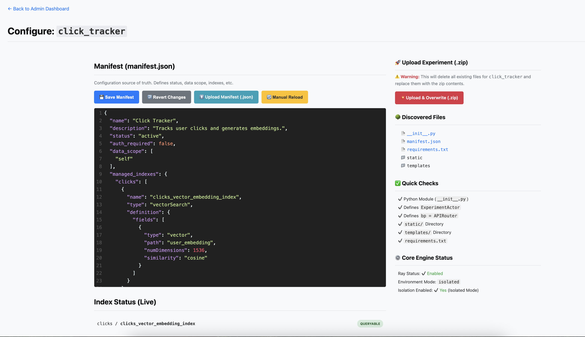

# g.nome  
  
  
  
The Missing Engine for Your Python and MongoDB Projects—a "WordPress-Like" platform built by a builder, for builders, designed to minimize the friction between idea and live application.  
  
If you're a builder, you know the feeling.  
  
You have a "digital garden" of scripts, tools, and prototypes. It's that little AI-powered chatbot you built for your family. It's the data-entry tool you made for a friend's small business. It's that internal dashboard for tracking... something.  
  
Each one was a great idea. Each one lives in its own isolated folder. And each one, slowly, becomes a maintenance burden.  
  
  
  
I call this the "prototype graveyard." It's where good ideas go to die, not because they weren't useful, but because the cost of maintaining them became higher than the value they provided.  
  
I hit this wall myself. Every new idea—no matter how small—meant starting from scratch. I had to write another user login page, another password-hashing function, another granular Role-Based Access Control (RBAC) system. And what if I wanted my new "stats dashboard" to read data from my old "click tracker"? That meant a tangled mess of hard-coded database connections and security holes waiting to happen.  
  
The pain wasn't in building the feature. The pain was in building the scaffolding around it.  
  
I realized I didn't need another one-off app. I needed an engine. A platform that could run all my projects, handle the boilerplate, and let them communicate securely.  
  
So, I built g.nome.  
  
---  
  
## Why g.nome?  
  
- It's the "genome" for your projects: a core piece of DNA that all your experiments inherit, so they grow securely and speak the same language.    
- It's the magical "gnome" for your "digital garden": a little helper working behind the scenes to handle the weeding (auth) and mend the fences (security), letting you focus on planting new ideas.    
- And for modern Python developers, it's the gateway that sits between your app and your database: a 'global' helper injected exactly where you need it, handling all the boilerplate.  
  
g.nome is the "WordPress-like" model I've always wanted for the modern FastAPI and MongoDB stack, designed to consolidate all those scattered projects into one powerful, maintainable ecosystem.  
  
---  
  
## A Platform, Not Just a Project  
  
The philosophy of g.nome is built on a simple separation of concerns:  
  
- **The CORE (The Engine)**: This is a single, central FastAPI application (`main.py`). It provides the "engine" for everything: user authentication, the admin panel, Backblaze B2 (S3-compatible) integration, and the dynamic loader. It's the part you only want to build once.  
  
- **The "Experiments" (The Plugins)**: This is where your ideas live. An "experiment" is just a folder you drop into the `/experiments` directory. It contains its own `APIRouter` (typically exposed as `bp`), optional templates, static files, logic, and now an optional `manifest.json`.  
  
- **The Admin Panel (The Control Tower)**: This is the magic. As an admin, you can log in to `/admin` and see a list of all your "experiments." You can "Activate" or "Deactivate" them, set them to require login, or configure their data-sharing rules. You can even upload entire experiments `.zip` files from the Admin Panel, letting g.nome push your code to Backblaze B2 seamlessly.  
  
And now, if you place a `manifest.json` in any `/experiments/<slug>/` folder, g.nome will read it on startup and automatically create a matching DB entry if none exists—so local experiments "just work," no tedious config required.  
  
This immediately solves the maintenance and authentication problem. But the real power comes from how it solves the data problem.  
  
---  
  
## Core Features  
  
  
  
- **Centralized Admin Panel**: A single GUI at `/admin` to manage all your experiments. Activate/deactivate, require authentication, and configure data-sharing with a few clicks.  
  
- **Automatic Data Sandboxing**: A smart `ScopedMongoWrapper` (from `async_mongo_wrapper.py`) automatically tags all database writes with an `experiment_id` and scopes all reads. Each experiment lives in its own "virtual" database by default.  
  
- **Automatic Index Management**: Define required MongoDB indexes (regular, Atlas Search, Vector Search) directly in your experiment's `manifest.json`. g.nome automatically creates and manages these indexes, applying slug-based prefixes (`<slug>_`) to both collections and index names to ensure proper scoping and prevent conflicts between experiments.<br/>⚙️ [See Appendix E](#appendix-e-index-management-via-manifestjson)  
  
- **Built-in Authentication**: Provides all core auth routes (`/auth/login`, `/auth/logout`) and dependency helpers like `get_current_user` and `get_current_user_or_redirect` (defined in `core_deps.py`) for securing your experiment's routes.  
  
- **Dynamic RBAC via casbin**: A fine-grained authorization layer built-in. Define roles (`admin`, `user`) and permissions for any experiment, all stored in the database and manageable without a redeploy. Policies are enforced via `require_permission()` and `require_admin()` dependencies.  
  
- **Flexible Front-end Hosting**:  
  - Custom Routes: Your experiment defines its own routes (like `@bp.get('/')`) and can render templates however it likes.  
  - Static Files: The CORE automatically mounts any `/experiments/<slug>/static/` folder so your experiment can serve its own CSS, JS, images, etc.  
  - Manifest-based Seeding: On startup, if g.nome sees that `/experiments/<slug>/manifest.json` is *not* in the database, it seeds the database entry. Perfect for local development or offline building of new experiments.  
  - Over-the-Air Updates: If you prefer an "upload" workflow, the Admin Panel provides a route to upload a `.zip`, and g.nome will automatically push it to Backblaze B2 (if configured), or store it locally, then reload. No restarts needed.  
  
- **Secure Data Sharing**: Securely grant one experiment read-only access to another's data from the Admin Panel by configuring `data_scope`.  
  
- **Hybrid Compute Runtime**: Run simple experiments in-process, or "promote" heavier experiments to run in isolated Ray Actors to solve dependency conflicts and scale. The system automatically detects Ray availability and falls back gracefully if unavailable.  
  
- **Graduation Path**: "Graduate" a successful experiment into its own standalone application with a simple `mongodump`—no data lock-in.  
  
- **B2 (S3-Compatible) Integration**: By setting environment variables for Backblaze B2 (`B2_ENDPOINT_URL`, `B2_BUCKET_NAME`, `B2_ACCESS_KEY_ID`, `B2_SECRET_ACCESS_KEY`), you enable seamless file storage. That means you can do a one-click upload of a new experiment zip from your local dev machine, and g.nome handles the rest.  
  
---  
  
## Magic #1: The Secret Sauce — Automatic Data Sandboxing  
  
Here's the biggest pain point of all: how do you let a dozen different apps share a single database safely?  
  
This is where most people get stuck. They either build a complex, error-prone permissions system, or they give up and just let every app have full access to the entire database—a security nightmare.  
  
g.nome solves this with `async_mongo_wrapper.py`. This module is an asynchronous "proxy" that sits between your experiment's code and the real database. In FastAPI, you don't use globals; you use Dependency Injection. When your experiment's route needs the database, it simply asks for it:  
  
```python  
# experiments/my-experiment/__init__.py  
from fastapi import APIRouter, Depends  
from core_deps import get_scoped_db  
from async_mongo_wrapper import ScopedMongoWrapper  
  
bp = APIRouter()  
  
@bp.get("/")  
async def my_route(db: ScopedMongoWrapper = Depends(get_scoped_db)):  
    # 'db' is now your sandboxed, async-ready database!  
    my_data = await db.my_collection.find_one({})  
    return {"data": my_data}  
```  
  
This wrapper does two things automatically:  
  
1. **It Tags All Writes**: When my "click-tracker" plugin writes a document, the wrapper silently injects a new field: `{"experiment_id": "click-tracker"}`. The plugin's code is completely "naive"—it doesn't even know this is happening.  
  
2. **It Scopes All Reads**: When that same plugin tries to read data (e.g., `await db.clicks.find()`), the wrapper intercepts the query and automatically adds a filter to only find documents matching the scopes defined in its config (by default, just its own `experiment_id`).  
  
By default, every experiment lives in its own "virtual" database.  
  
---  
  
## Magic #1.5: From Authentication to Authorization (with casbin)  
  
Setting `"auth_required": true` in your experiment config is great for basic "authentication" (i.e., who you are). But what about "authorization" (i.e., what you're allowed to do)?  
  
What if you want the `stats-dashboard` to be visible only to users with an `"admin"` role?  
  
This is the second half of the permissions puzzle, and g.nome solves it using casbin.  
  
### The Local/Dev Value  
  
When you first boot g.nome, it seeds the database with a default Role-Based Access Control (RBAC) model (defined in `casbin_model.conf`).  
  
- Your first user (e.g., `admin@example.com` from the `ADMIN_EMAIL` environment variable) is automatically assigned the `admin` role.  
- All other new users get the `user` role by default.  
- A default policy is created: `(admin, admin_panel, access)`.  
  
Your experiment code can then demand a specific permission just as easily as it asks for the database, using a pre-built dependency from `core_deps.py`:  
  
```python  
# experiments/stats-dashboard/__init__.py  
  
from fastapi import APIRouter, Depends, Request  
from fastapi.responses import HTMLResponse  
from typing import Mapping  
  
from core_deps import get_scoped_db, require_permission  
from async_mongo_wrapper import ScopedMongoWrapper  
  
bp = APIRouter()  
  
@bp.get('/', response_class=HTMLResponse, name="stats-dashboard_index")  
async def index(  
    request: Request,  
    db: ScopedMongoWrapper = Depends(get_scoped_db),  
    # This check runs before our code:  
    # 1. Ensures the user is logged in (redirects if not).  
    # 2. Checks if the user's role has 'access' permission on 'stats-dashboard'.  
    current_user: Mapping = Depends(require_permission(obj="stats-dashboard", act="access"))  
):  
    # This code only runs if the user is authenticated AND authorized  
    total_clicks = await db.clicks.count_documents({})  
    ...  
```  
  
### The "At Scale" Value  
  
This is where the magic really pays off. The casbin policies are stored in your MongoDB cluster (via `CasbinMotorAdapter`), not in a config file. This means:  
  
- You can build an Admin Panel page to add/remove policies dynamically.    
- Want to create a new `beta-tester` role? Do it in the GUI (or via code that manipulates the enforcer).    
- Want to grant that role access to `new-ai-experiment`? Save the policy.    
  
The authorization change is instant, with zero downtime and no redeployment. This is the power of a "policy-as-data" model, and it's built-in from day one.  
  
---  
  
## Magic #2: Convention-Based Templates & Static Files  
  
The "magic" doesn't stop at the database. g.nome makes it easy to serve both server-rendered templates and static assets for each experiment using a flexible convention:  
  
### Experiment-Local Templates  
  
Your experiment can define its own `Jinja2Templates` instance pointing to a local `templates/` folder within its directory. For example:  
  
```python  
# experiments/my-experiment/__init__.py  
import os  
from fastapi.templating import Jinja2Templates  
  
EXPERIMENT_DIR = os.path.dirname(os.path.abspath(__file__))  
templates = Jinja2Templates(directory=os.path.join(EXPERIMENT_DIR, "templates"))  
```  
  
Then, your route can `render templates.TemplateResponse("index.html", ...)`, which will look for `experiments/my-experiment/templates/index.html`.  
  
### Automatic Static File Mounting  
  
The CORE engine (`main.py`) automatically detects and mounts any `/experiments/<slug>/static/` directory when the experiment is loaded. This means your experiment can reference its own CSS, JavaScript, images, etc., at URLs like `/experiments/<slug>/static/js/app.js` without any extra configuration.  
  
### Fallback Info Page  
  
If an experiment doesn't define a route for `/` and doesn't have a `static/index.html` file, g.nome serves a default info page using the experiment's metadata from the database. This is a helpful safety net for API-only experiments or experiments still under development.  
  
This hierarchy means you can build any kind of web project, from a simple API to a full server-rendered app with custom templates. The g.nome engine will instantly know how to host it, secure it, and sandbox its data.  
  
---  
  
## Putting It Together: Anatomy of an "In-Process" Experiment  
  
Let's build a complete "click-tracker" experiment that shows how all the pieces fit together by convention.  
  
### Step 1: The Folder and Manifest  
  
You create a new folder: `/experiments/click_tracker`. Inside, you create a `manifest.json` file. (Note: g.nome uses this file during initial discovery, but the active source of truth for config is the database record in the `experiments_config` collection.)  
  
```json  
experiments/click_tracker/manifest.json:  
  
{  
  "name": "Simple Click Tracker",  
  "description": "Records its own page visits. Has no access to other data.",  
  "status": "draft",  
  "auth_required": false,  
  "data_scope": ["self"]  
}  
```  
  
### Step 2: The Python Code (The Router)  
  
This is the heart of your experiment. The CORE engine expects to find a variable named `bp` of type `APIRouter` in your `__init__.py` or `main.py`.  
  
```python  
# experiments/click_tracker/__init__.py  
import os  
import datetime  
import logging  
from fastapi import APIRouter, Depends, Request  
from fastapi.responses import HTMLResponse, JSONResponse  
from fastapi.templating import Jinja2Templates  
  
# --- Absolute Imports from the CORE ---  
from core_deps import get_scoped_db  
from async_mongo_wrapper import ScopedMongoWrapper  
# --- End Imports ---  
  
logger = logging.getLogger(__name__)  
  
# 1. Set up local templates  
EXPERIMENT_DIR = os.path.dirname(os.path.abspath(__file__))  
templates = Jinja2Templates(directory=os.path.join(EXPERIMENT_DIR, "templates"))  
  
# 2. CONVENTION: Define the main router as 'bp'  
bp = APIRouter()  
  
# 3. A route to serve the HTML page  
@bp.get('/', response_class=HTMLResponse, name="click_tracker_index")  
async def index(  
    request: Request,  
    db: ScopedMongoWrapper = Depends(get_scoped_db)  
):  
    # This read is automatically scoped to this experiment  
    my_click_count = await db.clicks.count_documents({})  
  
    # 4. Render using the LOCAL templates object  
    return templates.TemplateResponse(  
        'index.html', # Looks in experiments/click_tracker/templates/index.html  
        {  
            "request": request,  
            "count": my_click_count  
        }  
    )  
  
# 5. A route to serve as a JSON API  
@bp.post('/record-click', name="click_tracker_record_click")  
async def record_click(  
    db: ScopedMongoWrapper = Depends(get_scoped_db)  
):  
    # This write is automatically tagged with this experiment's ID  
    await db.clicks.insert_one({  
        "event": "button_click",  
        "timestamp": datetime.datetime.now(datetime.timezone.utc)  
    })  
  
    # This read is automatically scoped  
    new_click_count = await db.clicks.count_documents({})  
  
    return {"success": True, "new_count": new_click_count}  
```  
  
### Step 3: The Template (The HTML)  
  
You create your template in your experiment's local `/templates` folder.  
  
```html  
<div style="font-family: sans-serif; padding: 20px; background: #e0f7fa; border-radius: 8px;">  
  <h2>Experiment: Click Tracker</h2>  
  
  <p>  
    You have clicked the button   
    <strong id="click-count" style="font-size: 1.2em;">{{ count }}</strong>   
    time(s).  
  </p>  
  
  <button id="click-btn"  
          data-url="/experiments/click_tracker/record-click"  
          style="padding: 10px 20px; font-size: 1em; background: #007bff; color: white; border: none; border-radius: 5px; cursor: pointer;">  
    Click Me!  
  </button>  
</div>  
  
<script src="static/js/app.js"></script>  
```  
  
### Step 4: The Static Files (The JavaScript)  
  
You create a `static` folder inside your experiment folder. The CORE engine will automatically mount it at runtime.  
  
```js  
// This runs after the HTML page is fully loaded  
document.addEventListener('DOMContentLoaded', () => {  
    const clickButton = document.getElementById('click-btn');  
    const countSpan = document.getElementById('click-count');  
  
    // Safety check  
    if (!clickButton || !countSpan) {  
        console.error("Could not find button or count span!");  
        return;  
    }  
  
    // Get the API URL we stored in the 'data-url' attribute  
    const apiUrl = clickButton.dataset.url;  
  
    // Listen for a click on our button  
    clickButton.addEventListener('click', () => {  
        // Disable the button to prevent double-clicks  
        clickButton.disabled = true;  
        clickButton.innerText = "Clicking...";  
  
        // Call our new API route /record-click  
        fetch(apiUrl, {  
            method: 'POST',  
            headers: {  
                'Content-Type': 'application/json'  
            }  
        })  
        .then(response => response.json())  
        .then(data => {  
            if (data.success) {  
                // IT WORKED! Update the count on the page.  
                countSpan.innerText = data.new_count;  
            } else {  
                console.error("API Error:", data.error);  
                countSpan.innerText = "Error!";  
            }  
        })  
        .catch(error => {  
            console.error("Fetch Error:", error);  
            countSpan.innerText = "Error!";  
        })  
        .finally(() => {  
            // Re-enable the button  
            clickButton.disabled = false;  
            clickButton.innerText = "Click Me!";  
        });  
    });  
});  
```  
  
### Step 5: Activation  
  
  
  
That's it. You now have a fully self-contained experiment. You log into the `/admin` panel, find `"click_tracker"` in the list of discovered experiments, click **"Configure"**, set the status to `"active"`, and hit **"Save"**  
  
Your experiment is now live at `/experiments/click_tracker/`, secure, and sandboxed, all without writing a single line of boilerplate.  
  
---  
  
## The Payoff: Secure Cross-Experiment Data Sharing  
  
This is where it gets powerful.  
  
Let's say I want to build a new `stats_dashboard`. I want it to read from my `click_tracker` AND also write its own logs.  
  
### Step 1: I create my `stats_dashboard` folder.  
  
In the Admin Panel's "Configure" page for `stats_dashboard`, I set the `data_scope` to include both `self` and `click_tracker`:  
  
```  
Data Scope:  
[✓] self  
[✓] click_tracker  
```  
  
That `data_scope` configuration is the key. I'm telling the system, "This experiment needs to read its own data (self) and data from click_tracker."  
  
### Step 2: I write my code:  
  
```python  
# experiments/stats_dashboard/__init__.py  
import os  
import datetime  
import logging  
from fastapi import APIRouter, Depends, Request  
from fastapi.responses import HTMLResponse  
from fastapi.templating import Jinja2Templates  
from typing import Optional, Mapping  
  
# --- Absolute Imports ---  
from core_deps import get_scoped_db, get_current_user  
from async_mongo_wrapper import ScopedMongoWrapper  
# --- End Imports ---  
  
logger = logging.getLogger(__name__)  
  
# 1. Define the path to this experiment's directory  
EXPERIMENT_DIR = os.path.dirname(os.path.abspath(__file__))  
# 2. Define a LOCAL templates object pointing to this experiment's local 'templates' folder  
templates = Jinja2Templates(directory=os.path.join(EXPERIMENT_DIR, "templates"))  
  
bp = APIRouter()  
  
@bp.get('/', response_class=HTMLResponse, name="stats-dashboard_index")  
async def index(  
    request: Request,  
    db: ScopedMongoWrapper = Depends(get_scoped_db),  
    current_user: Optional[Mapping] = Depends(get_current_user)  
):  
    """  
    Serves the Stats Dashboard page:  
      - Reads click counts from scopes permitted by admin config (e.g., 'click_tracker').  
      - Writes a view log entry scoped to 'stats-dashboard'.  
      - Reads the count of its own view log entries.  
    """  
    total_clicks = 0  
    my_log_count = 0  
    user_email = current_user.get('email', 'unknown') if current_user else "Guest"  
    error_message = None  
  
    try:  
        # 1. (Cross-Experiment) Read from "clicks" if "click_tracker" is in data_scope  
        # The ScopedMongoWrapper automatically filters to only include docs from allowed scopes  
        total_clicks = await db.clicks.count_documents({})  
  
        # 2. (Scoped to "stats_dashboard") Write a view log  
        # The wrapper automatically tags this with experiment_id: "stats_dashboard"  
        await db.logs.insert_one({  
            "event": "dashboard_view",  
            "user": user_email,  
            "timestamp": datetime.datetime.now(datetime.timezone.utc)  
        })  
  
        # 3. (Scoped to "stats_dashboard") Read back the logs  
        my_log_count = await db.logs.count_documents({})  
    except Exception as e:  
        logger.error(f"stats-dashboard DB error for user {user_email}: {e}", exc_info=True)  
        error_message = f"Database error occurred: {e}"  
  
    return templates.TemplateResponse(  
        "index.html",  
        {  
            "request": request,  
            "total_clicks": total_clicks,  
            "my_logs": my_log_count,  
            "current_user": current_user,  
            "error_message": error_message  
        }  
    )  
```  
  
### Step 3: The template lives in your experiment's local folder:  
  
```html  
<!DOCTYPE html><html lang="en"><head>  
    <meta charset="UTF-8">  
    <title>Stats Dashboard</title>  
    <style>  
        body {  
          font-family: 'Inter', sans-serif;  
          padding: 20px;  
          background-color: #f8f9fa;  
        }  
        .container {  
          background: #ffffff;  
          padding: 30px;  
          border-radius: 12px;  
          max-width: 600px;  
          margin: 40px auto;  
          box-shadow: 0 4px 12px rgba(0, 0, 0, 0.1);  
        }  
        h2 {  
          font-size: 1.8rem;  
          color: #343a40;  
          border-bottom: 2px solid #dee2e6;  
          padding-bottom: 10px;  
          margin-bottom: 25px;  
        }  
        .stat-box {  
          margin-top: 20px;  
          padding: 15px;  
          border-radius: 8px;  
          border-left: 5px solid;  
        }  
        .stat-box p {  
          margin: 0;  
          font-size: 1.1rem;  
          line-height: 1.5;  
        }  
        .stat-box strong {  
          font-size: 1.2em;  
        }  
        .self-log {  
          border-left-color: #fd7e14;  
          background-color: #fff9e6;  
        } /* Orange */  
        .self-log strong {  
          color: #d95f02;  
        }  
        .cross-read {  
          border-left-color: #198754;  
          background-color: #e8f5e9;  
        } /* Green */  
        .cross-read strong {  
          color: #146c43;  
        }  
        .user-info {  
          margin-top: 30px;  
          font-size: 0.9em;  
          color: #6c757d;  
          text-align: right;  
        }  
    </style>  
</head><body>  
    <div class="container">  
        <h2>Experiment: Stats Dashboard</h2>  
  
        <div class="stat-box self-log">  
            <p>  
                This page view recorded <strong>(scoped to self)</strong>. Total views:  
                <strong>{{ my_logs }}</strong>  
            </p>  
        </div>  
  
        <div class="stat-box cross-read">  
            <p>  
                Total clicks recorded across  
                <strong>permitted experiments</strong>:  
                <strong>{{ total_clicks }}</strong>  
            </p>  
        </div>  
  
          
            <p class="user-info">Logged in as: {{ current_user.email }} (Admin)</p>  
          
            <p class="user-info">Viewing as Guest</p>  
          
    </div>  
</body></html>  
```  
  
### Step 4: I log into the Admin Panel at `/admin`  
  
Go to **"Configure: stats_dashboard"**, check the box for `click_tracker` under "Data Scope," set status to **"Active"**, and hit **"Save."**  
  
The server reloads active experiments. The plugin is live at `/experiments/stats_dashboard/`. I, as the developer, wrote zero lines of data-scoping logic. g.nome handled the security.  
  
---  
  
## The "Dependency Hell" Problem  
  
The "in-process" plugin model is fast and simple, but it has a hidden trap. What happens when your "click-tracker" experiment requires `pymongo==3.0` to work with an old script, but your brand-new "ai-chatbot" experiment needs `pymongo==4.6` for its async features?  
  
Your main application breaks. This is "dependency hell," and it's the death of any modular system. If every plugin has to agree on every version of every library, the system isn't modular at all.  
  
This is where g.nome's second, and most powerful, piece of magic comes in. It's not just a plugin loader; it's a hybrid runtime engine powered by Ray.  
  
---  
  
## Magic #3: The Hybrid Runtime (In-Process vs. Isolated)  
  
g.nome is built on a hybrid model that gives you the right tool for any job.  
  
### 1. The "In-Process" Experiment (The Simple Way)  
  
This is the pattern we just built, perfect for simple dashboards and APIs that share the main app's environment.  
  
**How it works**: You use `Depends(get_scoped_db)` to get the sandboxed database wrapper. Your routes run in the same process as the CORE FastAPI app.  
  
**Pro**: Very fast, easy to write, zero overhead.    
**Con**: Shares dependencies with the CORE and all other "in-process" experiments.  
  
### 2. The "Isolated" Experiment (The Actor Pattern)  
  
This is the solution for "dependency hell" and heavy-duty tasks. You "promote" an experiment to run as a Ray Actor—a stateful, isolated service in its own process with its own dependencies.  
  
**How it works**:    
- In your experiment's `actor.py`, you define an `ExperimentActor` class that references your target libraries.    
- If `G_NOME_ENV=isolated`, g.nome can parse your `requirements.txt` and automatically pass them to Ray as a dedicated `runtime_env` for that actor.    
- The "thin client" code in your `__init__.py` uses simple `await actor.method_name.remote()`, letting Ray handle concurrency or conflicting dependencies.  
  
**Automatic Fallback**: If Ray is unavailable or the actor fails to start, g.nome seamlessly falls back to a local service class that uses the standard `ScopedMongoWrapper` for database access. Your routes continue to work, just without the isolation or concurrency benefits of Ray.  
  
---  
  
## Anatomy of a "Hybrid" Experiment (The Full Pattern)  
  
Here's an extended version of the "click-tracker" experiment that demonstrates the hybrid pattern. This version includes both a Ray Actor and a local fallback service:  
  
```python  
# experiments/click_tracker/__init__.py  
"""  
{  
  "name": "Simple Click Tracker",  
  "description": "Records its own page visits. Has no access to other data.",  
  "status": "active",  
  "auth_required": false,  
  "data_scope": "self"  
}  
"""  
  
import logging  
import os  
import datetime  
  
# --- 1) Attempt to import Ray ---  
ray = None  
try:  
    import ray  
    RAY_IMPORT_SUCCESS = True  
except ImportError:  
    RAY_IMPORT_SUCCESS = False  
    logging.getLogger(__name__).warning("⚠️ Ray library not found. Running in non-distributed mode.")  
  
from fastapi import APIRouter, Depends, Request  
from fastapi.responses import HTMLResponse, JSONResponse  
from fastapi.templating import Jinja2Templates  
from typing import Any, Union  
from pathlib import Path  
  
# --- Absolute Imports ---  
from core_deps import get_scoped_db  
from async_mongo_wrapper import ScopedMongoWrapper  
# --- End Imports ---  
  
logger = logging.getLogger(__name__)  
  
# --- 2) Define a conditional decorator ---  
def _maybe_remote(cls):  
    """  
    If Ray is installed, return ray.remote(cls).  
    Otherwise, return the class unmodified.  
    """  
    if RAY_IMPORT_SUCCESS and ray is not None:  
        return ray.remote(cls)  
    return cls  
  
# --- 3) Paths / Templates Setup ---  
EXPERIMENT_DIR = Path(__file__).resolve().parent  
templates = Jinja2Templates(directory=os.path.join(str(EXPERIMENT_DIR), "templates"))  
  
# --- 4) Ray Actor (Only works if Ray is installed) ---  
@_maybe_remote  
class ExperimentActor:  
    """  
    Ray Actor for handling clicks when the Ray cluster is available.  
    """  
    def __init__(self, mongo_uri: str, db_name: str, write_scope: str, read_scopes: list):  
        from pymongo import MongoClient  
        self.client = MongoClient(mongo_uri)  
        self.db = self.client[db_name]  
        self.collection = self.db.clicks  
        self.write_scope = write_scope  
        self.read_scopes = read_scopes  
        logger.info(f"Ray Actor 'ClickTrackerActor' started. Write Scope: {self.write_scope}")  
  
    def _get_scoped_filter(self) -> dict:  
        return {"experiment_id": self.write_scope}  
  
    def record_click(self) -> int:  
        try:  
            self.collection.insert_one({  
                "event": "button_click",  
                "timestamp": datetime.datetime.now(datetime.timezone.utc),  
                "experiment_id": self.write_scope  
            })  
            return self.collection.count_documents(self._get_scoped_filter())  
        except Exception as e:  
            logger.error(f"ClickTrackerActor error in record_click: {e}", exc_info=True)  
            return -1  
  
    def get_count(self) -> int:  
        try:  
            return self.collection.count_documents(self._get_scoped_filter())  
        except Exception as e:  
            logger.error(f"ClickTrackerActor error in get_count: {e}", exc_info=True)  
            return -1  
  
# --- 5) Local Fallback Service (when Ray is OFF) ---  
class ClickTrackerLocalService:  
    """  
    A non-Ray fallback that mimics the Actor's interface  
    but uses the async ScopedMongoWrapper for I/O.  
    """  
    def __init__(self, db: ScopedMongoWrapper):  
        self.db = db  
        logger.debug("Initialized ClickTrackerLocalService (Ray fallback)")  
  
    async def record_click(self) -> int:  
        try:  
            await self.db.clicks.insert_one({  
                "event": "button_click",  
                "timestamp": datetime.datetime.now(datetime.timezone.utc),  
            })  
            return await self.db.clicks.count_documents({})  
        except Exception as e:  
            logger.error(f"ClickTrackerLocalService error in record_click: {e}", exc_info=True)  
            return -1  
  
    async def get_count(self) -> int:  
        try:  
            return await self.db.clicks.count_documents({})  
        except Exception as e:  
            logger.error(f"ClickTrackerLocalService error in get_count: {e}", exc_info=True)  
            return -1  
  
# --- 6) The Agnostic Service Dependency ---  
async def get_click_service(  
    request: Request,  
    db: ScopedMongoWrapper = Depends(get_scoped_db)  
) -> Union[Any, ClickTrackerLocalService]:  # Returns actor handle or local service  
    """  
    FastAPI Dependency: Provides the Ray Actor if Ray is available;  
    otherwise the local fallback service.  
    """  
    actor_name = "click_tracker-actor"  
    if request.app.state.ray_is_available:  
        try:  
            actor_handle = ray.get_actor(actor_name, namespace="modular_labs")  
            logger.debug(f"Using Ray Actor for {actor_name}")  
            return actor_handle  
        except ValueError as e:  
            logger.error(  
                f"Ray is available, but failed to get actor '{actor_name}': {e}. "  
                "Check Ray logs for actor startup errors. Using local fallback."  
            )  
            return ClickTrackerLocalService(db)  
        except Exception as e:  
            logger.error(  
                f"Unexpected error getting Ray actor '{actor_name}': {e}. Using local fallback.",  
                exc_info=True  
            )  
            return ClickTrackerLocalService(db)  
    else:  
        logger.warning("Ray is unavailable. Using local fallback service for click_tracker.")  
        return ClickTrackerLocalService(db)  
  
# --- 7) Define the APIRouter (The "Thin Client") ---  
bp = APIRouter()  
  
@bp.get('/', response_class=HTMLResponse, name="click_tracker_index")  
async def index(  
    request: Request,  
    service: Any = Depends(get_click_service)  
):  
    """  
    The main UI route for the Click Tracker experiment.  
    """  
    warning_message = None  
    my_click_count = -1  
  
    try:  
        if isinstance(service, ClickTrackerLocalService):  
            warning_message = "Ray compute cluster is offline or actor failed. Running in local mode."  
            my_click_count = await service.get_count()  
        else:  
            # Call the Ray actor method  
            my_click_count = await service.get_count.remote()  
        if my_click_count == -1:  
            warning_message = (warning_message or "") + " Error retrieving click count."  
    except Exception as e:  
        logger.error(f"Error in click_tracker index route: {e}", exc_info=True)  
        warning_message = f"Error rendering page: {e}"  
        my_click_count = -1  
  
    return templates.TemplateResponse(  
        'index.html',  
        {  
            "request": request,  
            "count": my_click_count if my_click_count != -1 else "Error",  
            "warning_message": warning_message  
        }  
    )  
  
@bp.post('/record-click', name="click_tracker_record_click")  
async def record_click(service: Any = Depends(get_click_service)):  
    """  
    API endpoint to record a new click.  
    """  
    try:  
        if isinstance(service, ClickTrackerLocalService):  
            new_click_count = await service.record_click()  
        else:  
            # Call the Ray actor method  
            new_click_count = await service.record_click.remote()  
  
        if new_click_count == -1:  
            raise HTTPException(status_code=500, detail="Error recording click.")  
  
        return {"success": True, "new_count": new_click_count}  
    except Exception as e:  
        logger.error(f"Error in record_click endpoint: {e}", exc_info=True)  
        return JSONResponse(  
            status_code=500,  
            content={"success": False, "error": f"An internal server error occurred: {e}"}  
        )  
```  
  
Now you get scalable concurrency (if you’re using a Ray cluster) *or* you fall back to plain in-process code otherwise.  
  
---  
  
## Magic #4: Over-the-Air Experiment Upload and Local Seeding  
  
Historically, you might have manually copied each experiment folder to the server’s `/experiments/<slug>` directory. Now, g.nome supports two powerful new workflows:  
  
1. **Local File Seeding**:    
   If you put a valid `manifest.json` into `/experiments/<slug>/` and start your server, g.nome calls `_seed_db_from_local_files` internally. If the database doesn't already have a config for `<slug>`, it inserts one—no manual steps required.    
   This is perfect for local development: new experiments are "discovered" automatically so you can test them before production.  
  
2. **Over-the-Air Zip Upload** (via Backblaze B2 / S3):    
   From the admin panel or an API call to `/admin/api/upload-experiment/<slug_id>`, you can upload a `.zip` containing everything your experiment needs (`actor.py`, `__init__.py`, `requirements.txt`, etc.).    
   - If B2 is configured via env vars (`B2_ENDPOINT_URL`, `B2_BUCKET_NAME`, `B2_ACCESS_KEY_ID`, `B2_SECRET_ACCESS_KEY`), g.nome automatically stores the zip in that bucket and sets a presigned URL in the experiment’s database record.    
   - On subsequent reload, Ray uses that presigned URL as a "py_modules" reference for fully isolated, versioned code.    
   - If needed, we also parse the `requirements.txt` from inside the zip, attach it to the experiment’s config, and pass those dependencies to Ray when `G_NOME_ENV=isolated`.    
   - The local "thin client" files are extracted to `/experiments/<slug>/`, letting you serve templates and static files as usual.    
  
This means you can push updates to your experiment’s codebase in seconds, from anywhere, without messing with server-side file systems manually. Combined with the Ray runtime environment isolation, you have a robust pipeline for shipping new features or conflicting dependencies seamlessly.  
  
---  
  
## The Payoff Continues: Scaling CPU-Bound Workloads  
  
The Actor pattern doesn't just solve dependency hell—it unlocks scalability.  
  
What about an experiment that does heavy CPU-bound work, like an image watermarker or a machine learning pipeline?  
  
- **The Old Way**: An "in-process" task would block the main server.    
- **The g.nome Way**: You define an actor that can spawn multiple Ray tasks, distributing the workload across all CPU cores in your cluster. Your main FastAPI process just triggers a method call on the actor, and Ray handles the rest.  
  
---  
  
## Focus on Your Differentiation, Not Your Boilerplate  
  
  
  
This is the convention-over-configuration powerhouse I've always wanted. Python and MongoDB Atlas are an incredible combination for innovation. Python (with FastAPI) is expressive and blazing fast, while Atlas provides a scalable, serverless data platform.  
  
The problem is that "glue" code still gets in the way.  
  
g.nome is designed to be that glue. It lets you focus 100% on your differentiation.    
  
By connecting this engine to a MongoDB Atlas cluster, every single one of my experiments instantly inherits a world-class infrastructure.  
  
- Want to add powerful, typo-tolerant search to your experiment? You don't need Elasticsearch. You just flip on Atlas Search, and your plugin can use it.  
- Want to build a rich visualization dashboard? You can embed Atlas Charts without rewriting your code.  
- Want an action to happen when a user registers? Hook up an Atlas Trigger to keep your logic simple.  
  
You stop worrying about managing users, scaling databases, or writing security filters. You just build your feature.  
  
---  
  
## Your Deployment, Your Choice  
  
g.nome's hybrid architecture is controlled by a single environment variable: `G_NOME_ENV`. By default, g.nome tries to connect to a Ray cluster. If Ray isn't installed or not found, it silently falls back to safe, in-process mode.  
  
### Two Key Modes  
  
**Production Mode (Default)**    
`G_NOME_ENV="production"` (or not set)    
  
Uses Ray if available, else fallback to in-process. The engine respects any `runtime_env` declared inside an experiment's actor class.    
  
**Isolated Mode**    
`G_NOME_ENV="isolated"`    
  
On startup, each experiment can parse a local `requirements.txt` file (via `_parse_requirements_file()`) and g.nome automatically creates a Ray actor with those specific dependencies in an isolated `runtime_env`. This is the definitive solution for mixing conflicting library versions.  
  
If Ray fails entirely, g.nome reverts each experiment to in-process mode. You still get all the core features (Admin Panel, RBAC, data sandboxing) with zero extra overhead.  
  
### Backblaze B2 (S3-Compatible) Config  
  
Set these environment variables if you want to enable Over-the-Air code uploads and storage:  
- `B2_ENDPOINT_URL` (e.g., `"https://s3.us-west-004.backblazeb2.com"`)  
- `B2_BUCKET_NAME`  
- `B2_ACCESS_KEY_ID`  
- `B2_SECRET_ACCESS_KEY`  
  
If these are set, g.nome will store experiment `.zip` files in your B2 bucket and generate presigned URLs to pass to Ray. Otherwise, it reverts to local or fallback logic.  
  
---  
  
## Appendix A: Graduating from the Incubator  
  
  
  
g.nome is a perfect "incubator." But what happens when your `click_tracker` becomes so successful it needs to "graduate" into its own, fully independent production application?  
  
Because g.nome tags all data with `experiment_id`, you have zero lock-in.  
  
1. **Copy the code**: Move your `click_tracker` folder to a brand-new repo, add a minimal FastAPI scaffolding (e.g., a standalone `main.py` that includes your experiment's router).  
  
2. **Export the data**: Use `mongodump` to export only the documents belonging to your experiment:  
   ```bash  
   mongodump --uri="<your-mongo-uri>" --db=labs_db --collection=clicks \  
             --query='{"experiment_id":"click_tracker"}' --out=./backup  
   ```  
  
3. **Import it into your new standalone Atlas cluster**:  
   ```bash  
   mongorestore --uri="<your-new-cluster-uri>" --db=my_new_db \  
                ./backup/labs_db/clicks.bson  
   ```  
  
You keep the business logic intact, with no painful rewriting.  
  
---  
  
## Appendix B: The g.nome Roadmap (Ideas for the Future)  
  
This solves the biggest pains I faced, but it opens up even more possibilities:  
  
- GUI for casbin Policies: Admin Panel interface to manage roles and permissions dynamically via web forms.    
- Inter-Experiment Event Bus: Let experiment-A emit an event that experiment-B subscribes to using a pub/sub pattern.    
- More Granular Data Scopes: e.g., read-only access to a single collection, or field-level permissions.    
- Shared "Service" Experiments: e.g., a `sentiment-analyzer` experiment that others can call as an internal API.    
- CLI Scaffolding Tool: `gnome create <name>` to quickly generate a new experiment folder with boilerplate files.    
- Global API Key Management: Issue keys that can call certain experiments or collections, bridging external apps to your g.nome ecosystem.    
  
---  
  
## Appendix C: A Familiar Pattern (For Fans of Microservices and Atlas App Services)  
  
If you're used to microservices or the original Atlas App Services, g.nome will feel pleasantly familiar.  
  
- **Experiment** = a small service or "function" with public routes, just like a microservice or an App Services function.    
- **Configuration (via Admin Panel)** = config for permissions & data sharing, similar to App Services rules.    
- **CORE (`main.py`)** = the central "gateway" that automatically provides authentication, sandboxing, and discoverability.  
  
You get the developer convenience of "functions," while staying in standard Python + FastAPI, with full control over your infrastructure and code.  
  
---  
  
## Appendix D: Deploying on Render.com (Fallback if Ray is Unavailable) 🚀  
  
g.nome is perfectly suited for streamlined hosting on Render. By default, if there's no Ray cluster, the system simply runs experiments in-process.  
  
- Connect to your GitHub and point a Render Web Service at your g.nome repo (or fork).  
- Add environment variables like:  
  
  ```  
  MONGO_URI         # Your MongoDB connection string (e.g., from Atlas)  
  FLASK_SECRET_KEY  # A strong random secret for JWT signing  
  ADMIN_EMAIL       # The email for the initial admin user  
  ADMIN_PASSWORD    # The password for the initial admin user  
  B2_ENDPOINT_URL   # (Optional) for Over-the-Air uploads  
  B2_BUCKET_NAME  
  B2_ACCESS_KEY_ID  
  B2_SECRET_ACCESS_KEY  
  ```  
  
- Deploy. The included Dockerfile (or Render's automatic Python detection) runs your entire app in a single container. If Ray is missing or fails to connect, it automatically uses the in-process fallback.  
- You still get every core feature (Admin Panel, RBAC, data sandboxing, local file seeding) with zero extra overhead.  
  
---  
  
## Appendix E: Index Management via `manifest.json` ⚙️  
  
g.nome simplifies database optimization by allowing experiments to declare necessary MongoDB indexes directly within their `manifest.json`. This declarative approach ensures that your experiments have the indexes they need to perform well, without manual intervention in the database.  
  
### Manifest Structure  
  
Inside `manifest.json`, you define indexes under the `managed_indexes` key. This is an object where keys are the **base collection names** (the name your experiment code uses, like `"clicks"` or `"products"`) and values are arrays of index definitions.  
  
Each index definition **must** include:  
  
- `"name"`: The **base name** for the index (e.g., `"user_timestamp"`, `"embedding_vector"`).    
- `"type"`: The type of index:    
  - `"regular"`: Standard MongoDB indexes. Requires a `"keys"` field (e.g., `{ "field": 1 }` or `[["field", -1]]`). Can optionally include an `"options"` object (e.g., `{ "unique": true }`).    
  - `"search"`: Atlas Search index (Lucene). Requires a `"definition"` field matching the Atlas Search index definition JSON.    
  - `"vectorSearch"`: Atlas Vector Search index. Requires a `"definition"` field matching the Atlas Vector Search index definition JSON.  
  
**Example**:  
  
```json  
// experiments/product_recommender/manifest.json  
{  
  "slug": "product_recommender",  
  // ... other keys ...  
  "managed_indexes": {  
    "products": [ // Base Collection Name  
      {  
        "name": "embedding_index", // Base Index Name  
        "type": "vectorSearch",  
        "definition": {  
          /* Atlas Vector Search definition */  
        }  
      },  
      {  
        "name": "category_price", // Base Index Name  
        "type": "regular",  
        "keys": { "category": 1, "price": -1 }  
      }  
    ],  
    "interactions": [ // Another Base Collection  
      {  
         "name": "user_ts", // Base Index Name  
         "type": "regular",  
         "keys": [ ["user_id", 1], ["timestamp", -1] ],  
         "options": { "sparse": true }  
      }  
    ]  
  }  
}  
```  
  
### Automatic Scoping (Prefixing)  
  
Crucially, g.nome enforces separation between experiments. It automatically prepends the experiment's `slug_id` followed by an underscore (`_`) to **both** the collection name and the index name before interacting with MongoDB.  
  
- **Manifest:** Collection `"products"`, Index `"embedding_index"`    
- **Actual in DB (for `slug="product_recommender"`):** Collection `product_recommender_products`, Index `product_recommender_embedding_index`  
  
This convention guarantees that indexes defined by one experiment won't collide with or overwrite indexes from another, even if they use the same base names in their respective manifests. ✅  
  
### How it Works  
  
When an experiment is activated or g.nome reloads:  
  
1. **Read & Prefix**: It reads the `managed_indexes` from the manifest and generates the prefixed names.    
2. **Ensure Collection**: It ensures the *prefixed* collection exists (creating it if needed).    
3. **Check Index**: It checks if an index with the *prefixed* name exists on the *prefixed* collection.    
4. **Compare & Act**:    
   - If the index exists, it compares the definition (`keys` for regular, `definition` for search/vector) against the manifest. If different, it updates (`search`/`vectorSearch`) or drops/recreates (`regular`).    
   - If the index *doesn't* exist, it creates it.    
5. **Wait (Search/Vector)**: For Atlas Search/Vector types, it waits until the index reports as `QUERYABLE` before completing the task.    
6. **Background Tasks**: Each index is managed in a non-blocking background task. Errors are logged but don't typically halt the entire application startup.  
  
This makes index management automated, version-controlled, and safely scoped to each experiment.  
  
---

## Appendix:  Workout Twins: The Power of Custom 'Image-Based' Vector Embeddings

In the world of fitness tech, we are drowning in data: heart rate (HR), speed, power, calories, and cadence. But how do you programmatically find a workout's "twin"—a session that looks and feels exactly the same? This is where the simple yet powerful technique of **Time-Series-to-Image Encoding** comes in, forming a unique, custom embedding model perfect for **Vector Search**.

---

### Why Not Just Use Traditional Averages? ⚖️

If you wanted to find similar workouts, you could compare average HR, total calories, and max speed. However, two very different workouts might have the same averages:
* A **Steady-State Run** (HR: 150 bpm, constant speed)
* An **Interval Session** (HR: 120 bpm $\rightarrow$ 180 bpm $\rightarrow$ 120 bpm, varying speed)

Both could easily average out to the same metrics, fooling simple comparisons. We need a way to capture the *shape* and *progression* of the effort over time.

---

### The Trick: Time-Series as a Visual Fingerprint 🖼️

The code you analyzed uses a brilliant "trick" that transforms a 64-minute workout's progression into a unique, fixed-size vector.

1.  **Normalization & Mapping:** Each of the three key metrics—Heart Rate, Calories/Min, and Speed—is independently scaled from its physiological range (e.g., HR 50-200 bpm) to a simple pixel intensity range (0-255).
2.  **Color Channel Assignment:** Each metric is assigned a specific color channel: Heart Rate to **Red**, Calories to **Green**, and Speed to **Blue**. This creates a $64$-element, 1D array for each color.
3.  **The "Folding" Step:** The 1D arrays are reshaped (or "folded") into tiny **8x8** 2D matrices. Stacking these three colored matrices creates a single **8x8x3** RGB image. This image is the workout's **visual fingerprint**. 

---

### The Final Step: Custom Feature Embedding for Vector Search

The $8 \times 8 \times 3$ image array is immediately flattened into a dense, **192-dimension vector**. This is your custom embedding.

The power of this technique is that it is a highly **deterministic, engineered embedding model**. It ensures that any two workouts with visually and physiologically similar patterns will have resulting 192D vectors that are **close together in vector space**.

When a user views their current workout, the application can instantly:

1.  Generate the current workout’s 192D vector.
2.  Pass this vector to **MongoDB Atlas Vector Search** using the `$vectorSearch` pipeline.
3.  Retrieve the closest "Workout Twins" based on **cosine similarity**.

This allows the system, as seen in the code, to use **Retrieval-Augmented Generation (RAG)**. The analysis prompt sent to the LLM now includes context from similar, past sessions, enabling the AI to perform a far deeper **"Radiology Task"**: diagnosing if today's high-effort metrics align with a recovery tag, or if a slow pace looks exactly like a race day a year ago.

This custom encoding technique is a fantastic example of applying ML principles to real-world data problems without requiring the vast computational resources needed for training complex models. It’s smart, fast, and directly solves the problem of finding **pattern similarity**.

---

## Appendix F: The Core Rationale for Ray in g.nome ⚡

The complex, asynchronous, and hybrid data processing application at the core of g.nome is an ideal candidate for Ray because it contains **multiple, distinct bottlenecks** and **long-running, CPU-bound tasks** that directly interfere with the responsiveness of your FastAPI web server.

The core reason Ray is good for this specific architecture is **Heterogeneous Scalability** and **Separation of Concerns**. Ray allows you to decouple the fast I/O event loop (FastAPI/Motor) from the slow, heavy computation (NumPy, Matplotlib, LLM calls) and scale them independently.

---

### 1. Decoupling Compute and I/O (The GIL Problem) 🛑

Your application runs on Python, which has the **Global Interpreter Lock (GIL)**. The GIL prevents multiple threads from executing Python bytecode simultaneously, meaning any code that heavily uses the CPU (like complex NumPy, array reshaping, or Matplotlib rendering) will **block all other operations** running on that process, including your FastAPI and asynchronous MongoDB I/O.

* **FastAPI/Motor:** These libraries are designed for **I/O-bound** tasks (waiting for the database, waiting for the LLM API). They excel in the `asyncio` loop.
* **NumPy/Matplotlib/Feature Generation:** These are **CPU-bound** tasks.

**Ray's Solution:** Ray runs tasks and actors in **separate processes**, effectively bypassing the GIL. By decorating your heavy functions (e.g., `get_feature_vector`, `generate_chart_base64`) with `@ray.remote`, you immediately offload them to dedicated CPU cores, ensuring they **do not block** the FastAPI event loop.

---

### 2. Managing Blocking I/O and Long-Running Tasks ⏱️

Your code has critical blocking points that are detrimental to a web server's concurrency. Ray's Actor and Task model turns these blockers into efficient background jobs:

| Blocking Task | Location in Code | Why Ray Helps |
| :--- | :--- | :--- |
| **Vector Generation** | `get_feature_vector` (called in `/generate`) | This is a CPU-heavy NumPy task. Ray runs it in a background process, keeping the `/generate` endpoint responsive for other clients. |
| **Chart/Image Generation** | `generate_chart_base64` (called in `/workout/{id}`) | Matplotlib plotting is CPU-intensive. Ray allows you to run all 7 visualization generation steps in **parallel** across multiple CPU cores, dramatically speeding up the detail page load time. |
| **LLM Index Polling** | `_wait_for_search_index_ready` (in `startup_event`) | The `asyncio.sleep()` loop in `startup_event` can block the entire app launch for minutes. Running the indexing process inside a **Ray Actor** allows the FastAPI server to start instantly while Ray monitors the index in the background. |

---

### 3. Simplified Bulk Parallelism for RAG 🧠

The entire workflow for the analysis is a multi-step task (Vector Search, Prompt Generation, LLM Call). For a single workout, the latency is tolerable, but for batch processing 1,000 workouts (bulk analysis), you need true concurrency.

**Ray's Solution:** Ray allows you to map your analysis function onto a large set of data points (workout IDs). Ray's scheduler automatically handles the **concurrent execution and resource management** for all 1,000 requests, efficiently using all available cluster resources (CPUs for prompt generation, network bandwidth for LLM calls) without the developer needing to manage queues, process pools, or complex `multiprocessing` logic.

Ray offers the right set of tools to **scale this hybrid workload horizontally**—from a laptop's multiple cores to an entire cloud cluster—with almost no change to your core business logic.

---

Here is a new section, formatted as an appendix, to add to your documentation.

-----

## Appendix G: Local Development with HTTPS (SSL) 🔐

When you're building locally, you often run into a frustrating modern web problem: many features simply **require HTTPS (`https://`) to work**, even on `localhost`. This includes:

  * **Secure Cookies**: Setting cookies with the `Secure` flag (essential for robust authentication).
  * **OAuth Callbacks**: Services like "Sign in with Google" or "Sign in with GitHub" often refuse to redirect back to an `http://` address.
  * **Browser APIs**: Many new APIs, like geolocation, camera/microphone access, or web crypto, are disabled by browsers on insecure origins.

Since g.nome is designed to be the engine for *all* your projects, it needs to support this workflow. Because g.nome is a standard FastAPI application at its core, enabling local SSL is straightforward.

### Step 1: Create a Self-Signed Certificate

You only need to do this once. Run the following `openssl` command in the root directory of your g.nome project. This will generate two files: `localhost.key` and `localhost.crt`, valid for one year.

```bash
openssl req -x509 -newkey rsa:4096 -nodes -keyout localhost.key -out localhost.crt -days 365 -subj "/CN=localhost"
```

  * `req -x509`: Creates a self-signed certificate.
  * `-newkey rsa:4096`: Generates a new 4096-bit RSA private key.
  * `-nodes`: "No DES," meaning the private key won't be encrypted with a passphrase (ideal for local dev).
  * `-keyout/ -out`: Specifies the output filenames for the key and certificate.
  * `-subj "/CN=localhost"`: Sets the "Common Name" to `localhost`, which is what the browser will check.

### Step 2: Run g.nome with Uvicorn's SSL Flags

Now, simply tell `uvicorn` (the ASGI server that runs FastAPI) to use these files when it starts. If you normally run your app with a command like `uvicorn main:app --reload`, you just need to add two flags:

```bash
uvicorn main:app --reload --ssl-keyfile=localhost.key --ssl-certfile=localhost.crt
```

Your server will now start on `https://localhost:8000` instead of `http://localhost:8000`.

### Step 3: Trusting Your Local Certificate

Your browser will now show a **"Not Secure"** warning (e.g., "NET::ERR\_CERT\_AUTHORITY\_INVALID").

**This is expected and normal.**

It's happening because the certificate was signed by "you" (via `openssl`), not by a globally trusted Certificate Authority (CA) that the browser recognizes.

> **The Fix:** Simply click **"Advanced"** and then **"Proceed to localhost (unsafe)"**.
>
> Your browser will remember this exception for `localhost`, and your g.nome instance will now be running with a valid `https://` connection, allowing all your secure-only features to work perfectly.

---
  
## Conclusion  
  
g.nome helps you ship ideas quickly, without burying yourself in repetitive boilerplate. You get a single engine that can grow alongside your experiments—everything from tiny prototypes to fully isolated, Ray-powered microservices—while ensuring you can "graduate" any successful idea to its own dedicated codebase and database. Build fast, stay secure, and never fear the "prototype graveyard" again.